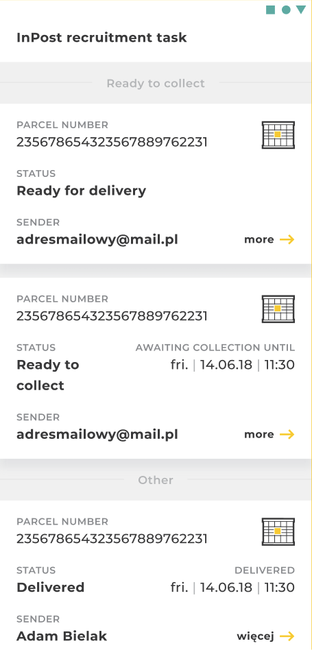

# InPost Recruitment Task
===========================================================
This project is sample offline-first, Android app. It's a racruitment task but also, it's designed to be a
playground for testing various architecture solutions and new libraries.

### Building
No special operations needed - just run project in Android Studio.

### Testing
* Unit tests - UseCase and ViewModel unit tests for domain layer verification.
* Screenshot tests - experimental Compose Screenshot library was used to perform screenshot tests.
It doesn't work well, because it's in Alpha stage, but it's not commercial project, so why not test it :)
* Instrumented tests - Right there are no instrumented tests. There will be reason for adding them,
after adding details screen in the future. Instrumented tests, will be helpfull in testing navigation.

## TODO
- Add WorkManager for cyclical background data refreshing in :data module
- Add polish translations to shipmentlist module

### Tech stack
Project follows Google's architecture recommendations and uses Architecture Components. Here are main
components/libraries used:

* Jetpack (with Compose)
* Material Design 3
* Kotlin Coroutines with FLow
* Moshi
* Room
* Dagger + Hilt
* Mockk
* Compose Screenshot
* Turbine

## Architecture
Project have multi-module architecture. It's an overkill to make such complex architecture for such
a small project, but it's goal was to make it as if it was big commercial project.

It consists of following layers:

#### Core
All `core:` modules contains classes used across the app, including styling and testing setup.

#### Data layer
Offline first source of data in the app - all data fetched from fake network is saved in database. UI and
domain layers get data from database - never from network directly.

* `data:network` module fetches data from fake InPost server and maps it to `domain:data` models.
* `data:database` module stores data in Room database and and maps it to `domain:data` models.
* `data` module orchestrates fetching, storing and mapping data from previous two. It implements
Repository interfaces from `domain` module

`data:network` and `data:database` modules have their own models this is done to make them independent
of each other and to make code cleaner. Both modules don't know about each other and mapping between
models is done through `domain:data` model.

#### Domain layer
Place for business logic represented by `UseCase`-s, and data model which serves as single point of 
truth for entire application. Project follows Clean Architecture principles, so all other modules
in the app depends on `domain` module.

* `domain` - place for all UseCase's and Repository interfaces
* `domain:data` - contains main data classes used across the app.

#### UI layer
* UI elements build using `Jetpack Compose`
* `ViewModel`-s
* Stored in `feature:xxx` modules
* Has it's own `data` model. Thanks to this approach all transformations of `domain` model 
(like dates formating) are done in easy to test `Mapper`-s instead of @Composable-s. This gives good
separation of business logic from UI logic. 
===========================================================
# Task descricption

## Intro
We travel back in time ⏱️. InPost Mobile app was just created and you join the team to improve its feature set and make it ready for the future.
User base is growing fast and every day more people start to use it daily.

You, as an experienced developer, were assigned to the project to improve its quality. The initial code is not perfect and is far from being.
Organize and refactor code the way you like to work (packages, modules, layers, data flow, names, methods order etc.).

## Rules
- You can change and move any part you like (except JSON file), install any open source library you want
- A static JSON file is returned in response, **consider this is a real production environment** returning your data
- JSON file cannot be changed
- Git history is also important
- Feel free to comment your choices

## Tasks
1. Add grouping to the list of Shipments by flag **ShipmentNetwork.operations.highlight**
2. Style list items as in Figma (link: https://www.figma.com/file/E7vZMYESnKvmzn70FenrhP/InPost)
3. Sort list items in groups by (the closest date to current date should be at top of the list):
    * status - order is described in `ShipmentStatus.kt` file (the higher order, the higher it should be on the list)
    * pickupDate
    * expireDate
    * storedDate
    * number
4. Add pull to refresh and handle refresh progress
5. Add storing shipments locally (use Room)
6. Add local archiving of the shipment:
    * We consider archiving as hiding the shipment from the list of `Shipment`s
    * Design is not important here
    * `Shipment` must stay hidden after re-downloading data or relaunching the app
    * Use flag **ShipmentNetwork.operations.manualArchive**
7. Create unit tests

## Links and resources
- Fonts folder: [/app/src/main/res/font](./app/src/main/res/font)

If for some reason Figma link stops working, here you can see the requested design:

# Good luck! 💪
